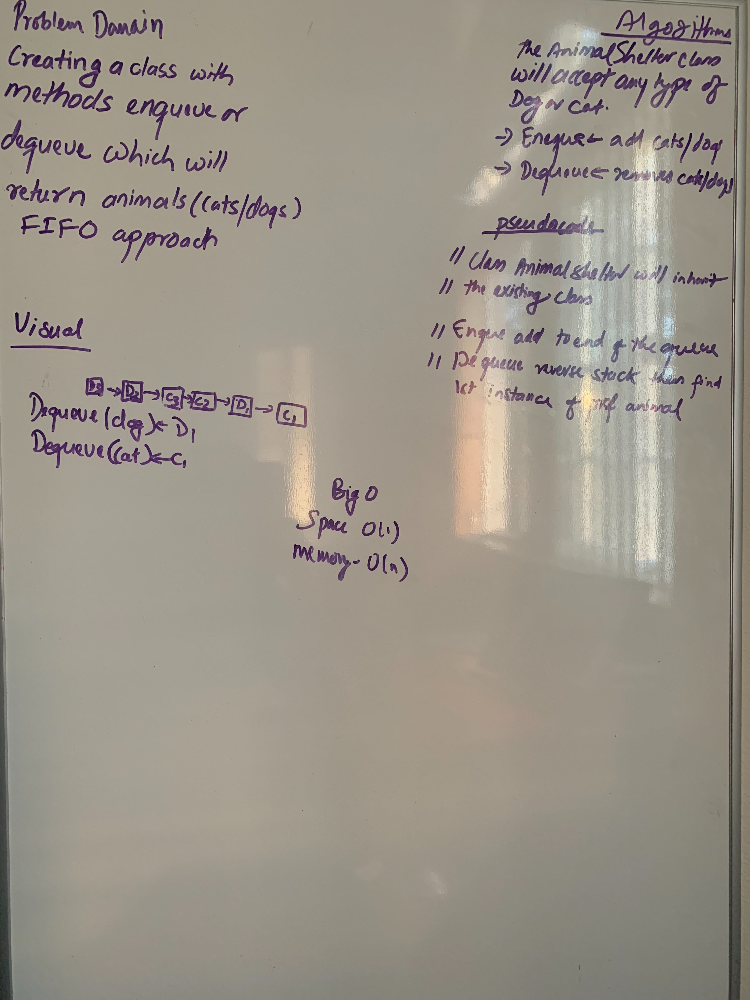

# Animal Shelter
<!-- Short summary or background information -->
In this Challenge I am creating class enqueue and dequeue which will return cats and dogs in FIFO approach

## Challenge
My approach was to create two classes Cat and Dog. Using the previous methods enqueue and dequeue to get the desired 
animal from the Animal Shelter. 
## Approach & Efficiency
<!-- What approach did you take? Why? What is the Big O space/time for this approach? -->
### Big O
* Time: O(n)
* Memory: O(1)

## API
<!-- Description of each method publicly available to your Stack and Queue-->
* AnimalShelter
* Enqueue
* Dequeue

## Solution:
[Code](../src/main/java/code401Challenges/stacksandqueues/AnimalShelter.java) | 
[Test](../src/test/java/code401Challenges/stacksandqueues/AnimalShelterTest.java)

