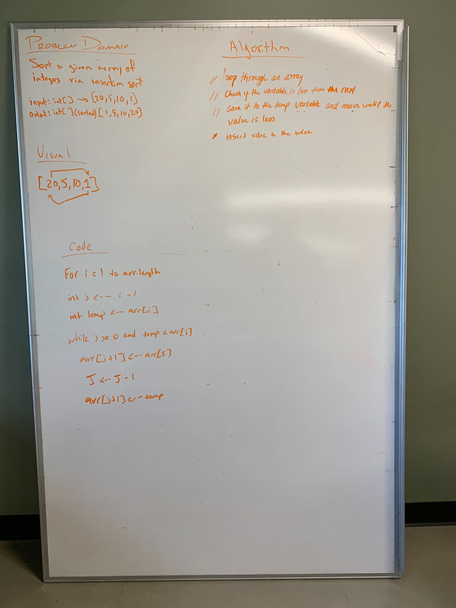

# Challenge Summary
<!-- Short summary or background information -->
This challenge will sort the elements inside an array and insert to the index.

## Challenge Description
<!-- Description of the challenge -->
In this challenge, an array is given which needs to be sorted and the value is inserted at the index.

## Approach & Efficiency
<!-- What approach did you take? Why? What is the Big O space/time for this approach? -->
I took the approach to loop through an array and run two index i and j to compare the values next to each other.
If the next value is smaller, save it as temp value and insert when its respective index is found.

### Big O
* Space - O(1)
* time - O(n)

## Solution
[Code](../src/main/java/code401Challenges/InsertationSort/insertionSort.java) |
[Test](../src/test/java/code401Challenges/InsertationSort/insertionSortTest.java)
| [Lecture](/lecture.md)

