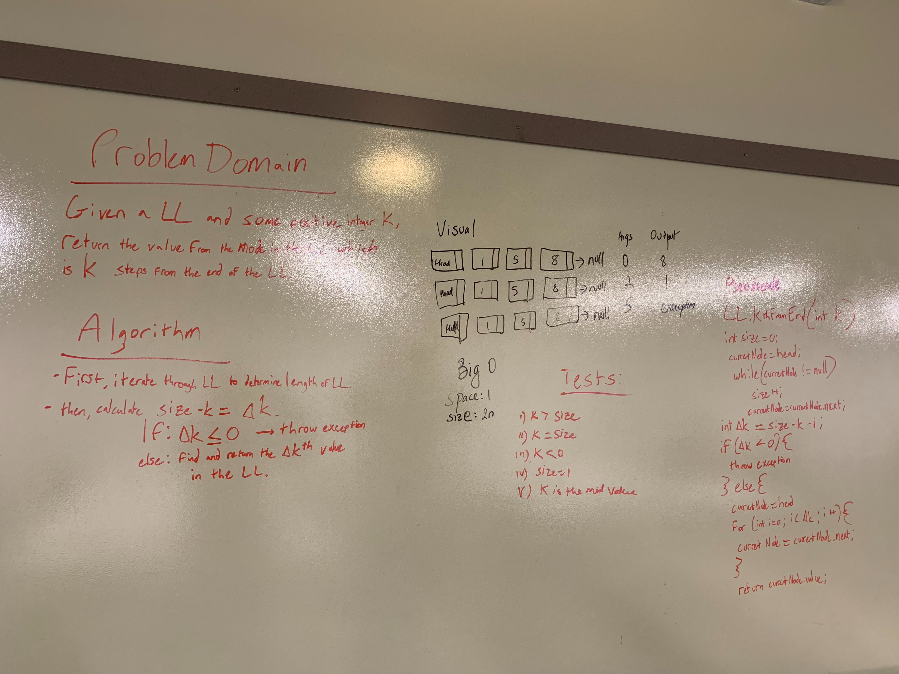

# Challenge Summary
This challenge will implement three methods to append to a node, insert before and after the node

## Challenge Description
 

## Approach & Efficiency
 I used an approach to iterate across the Linked List to find the target and append, insert before and after for the 

## Solution
[code](../src/main/java/code401Challenges/linkedlist/LinkedList.java) | [Test](../src/test/java/code401Challenges/linkedlist/LinkedListTest.java)

 
