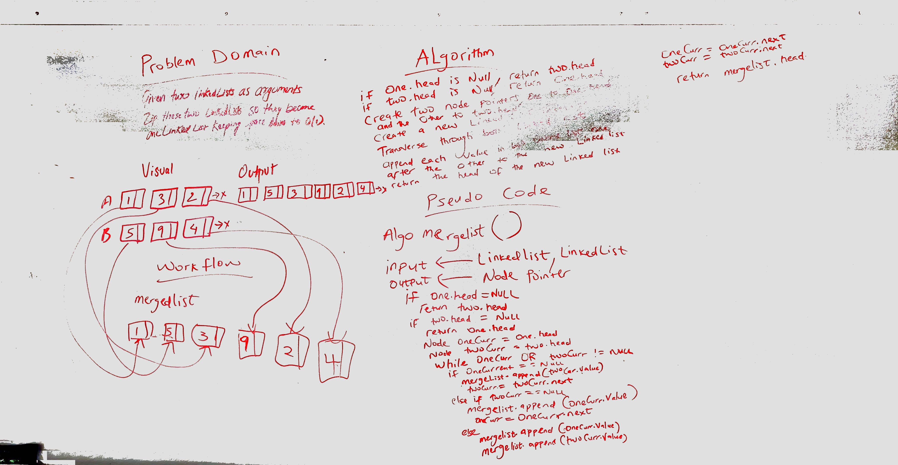

  ## Challenge 08 ## 
  ### Merge two linked lists ###
  ####Summary:
  Given two linked Lists, one need to merge two linked lists so the values from the Linked Lists come from each nodes 
  one at a time and returns the head of the new linked List.
  
  ####Description
  Write a method which takes two Linked lists as arguments. Zip the two linked lists with alternate nodes between the two linked Lists.
  ####Approach & Efficiency
  Space: O(n+m)
  time:O(n)
  ####Solution

[code](../src/main/java/code401Challenges/linkedlist/LinkedList.java) | 
[Test](../src/test/java/code401Challenges/linkedlist/LinkedListTest.java)