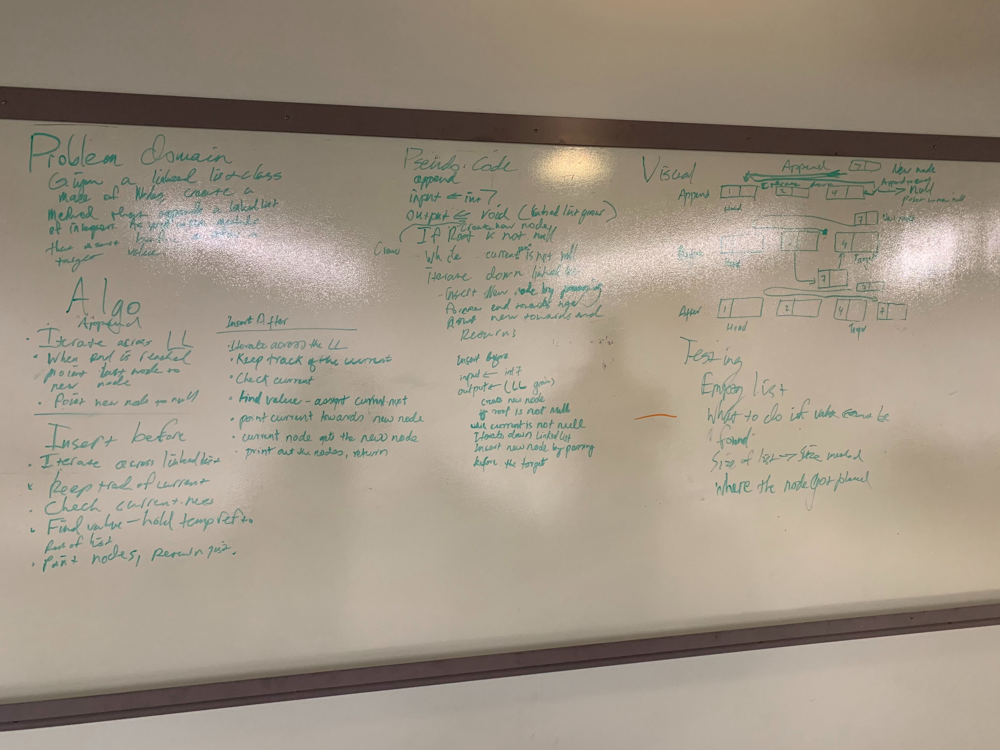

# Challenge Summary
This challenge will implement three methods to append to a node, insert before and after the node

## Challenge Description
 Created a Linked List that can perform append, insert before and and after the target value.

## Approach & Efficiency
 Space:O(n)
 Size:O(n)

## Solution
[code](../src/main/java/code401Challenges/linkedlist/LinkedList.java) | 
[Test](../src/test/java/code401Challenges/linkedlist/LinkedListTest.java)

 

