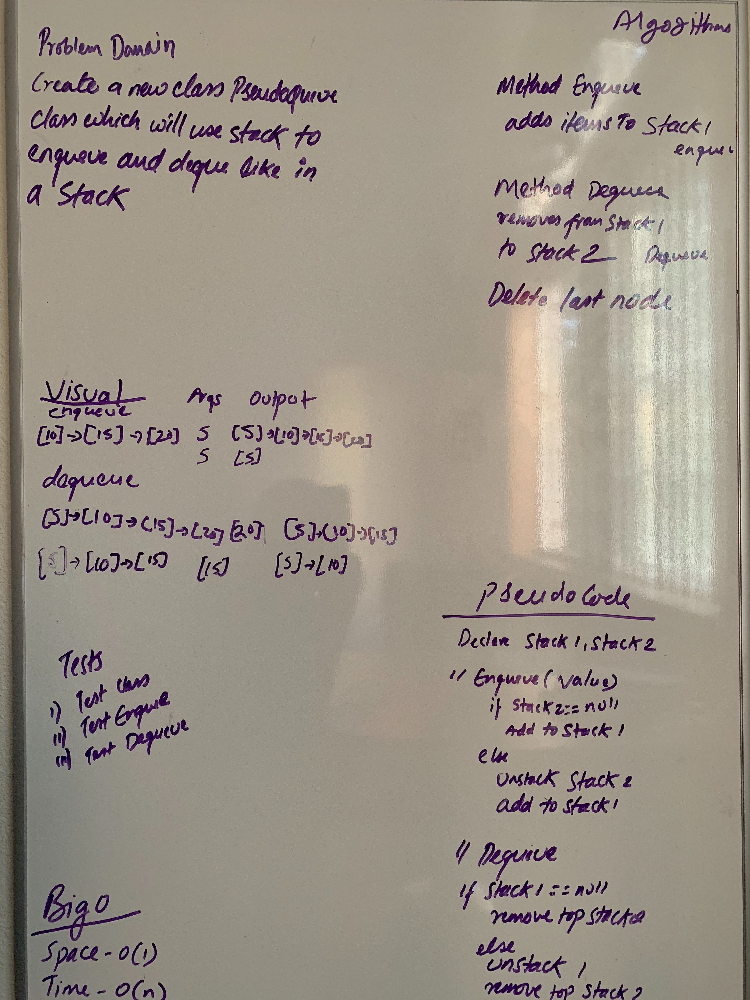

# Stacks and Queues
<!-- Short summary or background information -->
 Use Stack class to enqueue and Dequeue the Node
                                        
 ## Challenge
  My approach was to create two stacks in which one stack hold all the values for enqueuing which then is pushed
                                        into another stack and pop off top for dequeuing 
                                        
 ## Approach & Efficiency
<!-- What approach did you take? Why? What is the Big O space/time for this approach? -->
 ## Big O
  * Space: O(n)
  * Memory: O(1)
                                        
 ## API
 <!-- Description of each method publicly available to your Stack and Queue-->
  * Enqueue
  * Dequeue
  
 ## Solution:
 [Code](../src/main/java/code401Challenges/stacksandqueues/PseudoQueue.java) | 
 [Test](../src/test/java/code401Challenges/stacksandqueues/PseudoQueueTest.java)
                                        
 
