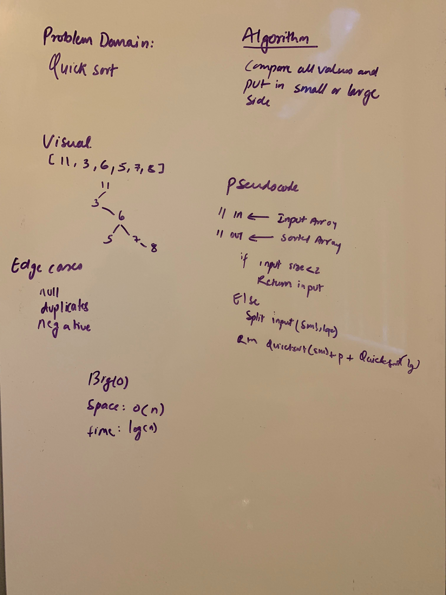

# Challenge Summary
<!-- Short summary or background information -->
Implement Quick Sort

## Challenge Description
<!-- Description of the challenge -->
Quick Sort is a divide and conquer algorithm which picks up a pivot point and divides an array around the pivot point. The pivot points can be first, last, middle or random index.

## Approach & Efficiency
<!-- What approach did you take? Why? What is the Big O space/time for this approach? -->
Big(o)
Time: O(n*log(n))
Space: O(n)

## Solution
[Lecture](./QuicksortLecture.md)

[Code](../src/main/java/code401Challenges/insertionSort/QuickSort.java) |
[Test](../src/test/java/code401Challenges/insertionSort/QuickSortTest.java)
