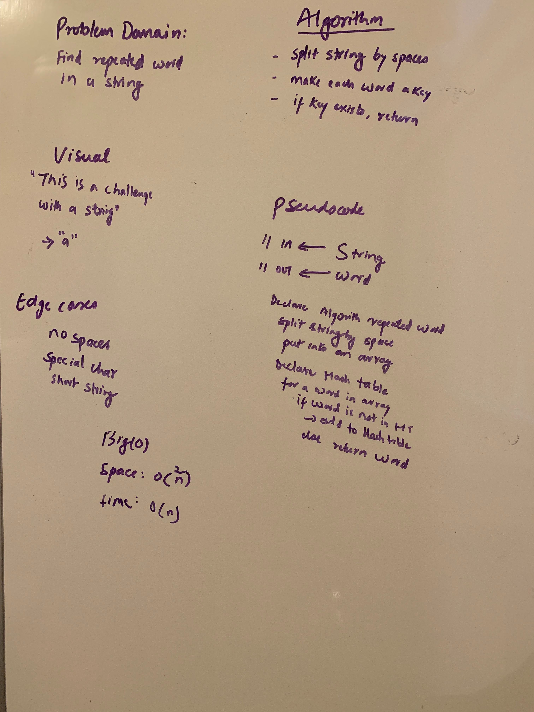

# Challenge Summary
<!-- Short summary or background information -->
Repeated word finder
## Challenge Description
<!-- Description of the challenge -->
This Challenge will split a given string using the split method at the white space using regex.
 It is then saved in a HashSet if it is unique otherwise is returned.

## Approach & Efficiency
<!-- What approach did you take? Why? What is the Big O space/time for this approach? -->
Big O
* space O(n*n)
* time O(n)

## Solution
<!-- Embedded whiteboard image -->
[Code](../src/main/java/code401Challenges/hashTable/RepeatedWord.java) | 
[Test](../src/test/java/code401Challenges/hashTable/RepeatedWordTest.java) |

