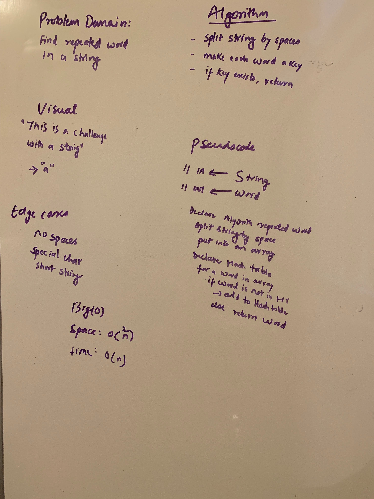

# Challenge Summary
<!-- Short summary or background information -->
Find Intersection of the tree
## Challenge Description
<!-- Description of the challenge -->
This Challenge will find the common values from two trees.

## Approach & Efficiency
<!-- What approach did you take? Why? What is the Big O space/time for this approach? -->
Big O
* space O(n)
* time O(n)

## Solution
<!-- Embedded whiteboard image -->
[Code](../src/main/java/code401Challenges/hashTable/TreeIntersection.java) |
[Test](../src/test/java/code401Challenges/hashTable/TreeIntersectionTest.java) |

