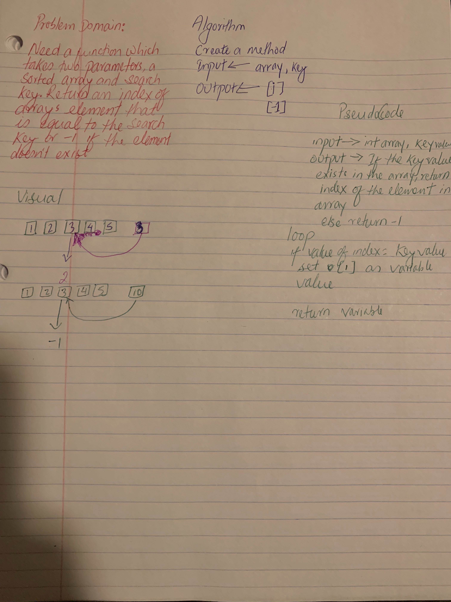

# Challenge Summary

## Challenge Description
<!-- Description of the challenge -->

## Approach & Efficiency
<!-- What approach did you take? Why? What is the Big O space/time for this approach? -->

## Solution
[Code](../src/main/java/code401Challenges/biniarySearch.java) | [Test](../src/test/java/code401Challenges/biniarySearchTest.java)

