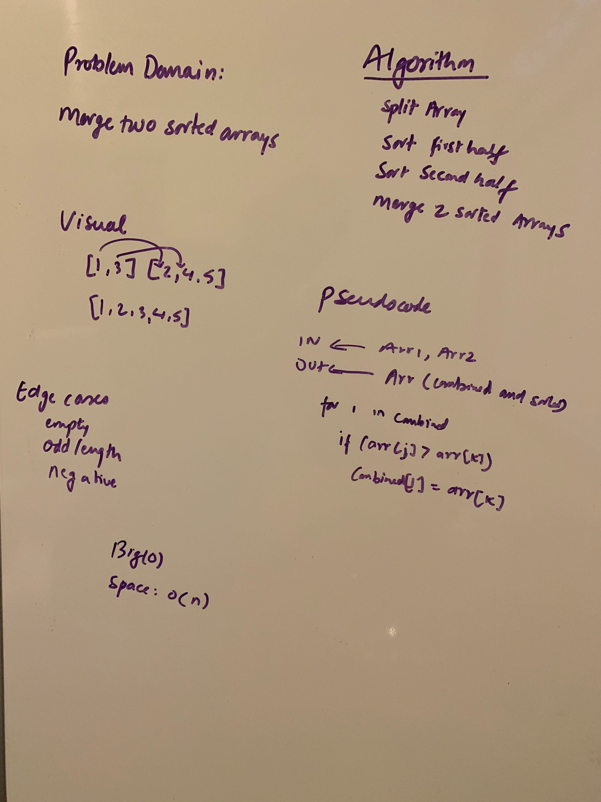

# Challenge Summary
<!-- Short summary or background information -->
This is a challenge about Merge Sort evolved from the pseudo code
## Challenge Description
<!-- Description of the challenge -->

This is a challenge designed to deliver lecture to the 301 students

## Approach & Efficiency
<!-- What approach did you take? Why? What is the Big O space/time for this approach? -->
Big O
* space O(log(n))
* time O(1)

## Solution
<!-- Embedded whiteboard image -->
[Code](../src/main/java/code401Challenges/insertionSort/MergeSort.java) | 
[Test](../src/test/java/code401Challenges/insertionSort/MergeSortTest.java) |
[Lecture]()|
