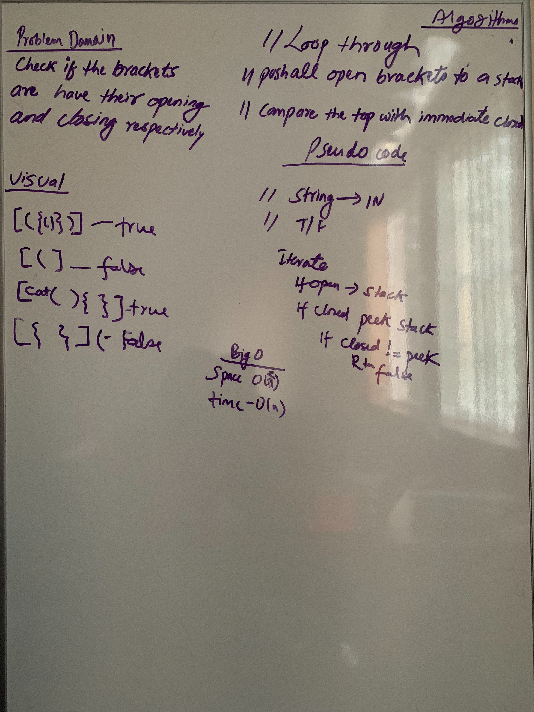

# MultiBracket Challenge
<!-- Short summary or background information -->
 Looping through the string to find if the brackets are open and closed
                                        
 ## Challenge
  My approach was to iterate through the string to find if the brackets have opening and closing brackets. I pushed all 
  the open brackets into a stack and compared with the top of the stack. If they have match then can pop out of the stack
                                        
 ## Approach & Efficiency
<!-- What approach did you take? Why? What is the Big O space/time for this approach? -->
 ## Big O
  * Space: O(n2)
  * Memory: O(1)
                                        
 ## API
 <!-- Description of each method publicly available to your Stack and Queue-->
  * multiBracketValidation
  
  
 ## Solution:
 [Code](../src/main/java/code401Challenges/stacksandqueues/MultiBracketValidation.java) | 
 [Test](../src/test/java/code401Challenges/stacksandqueues/MultiBracketValidationTest.java)
                                        
 